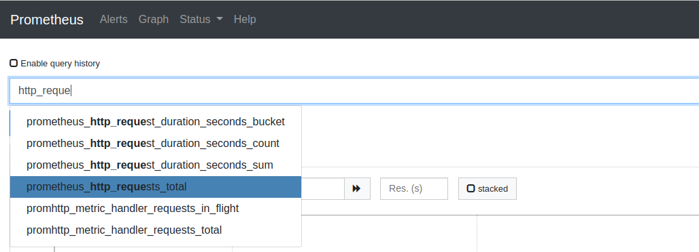

# Prometheus
Prometheus is an open source application used to monitoring applications and collecting metrics. Prometheus get metrics from application endpoints, and this is the motive for the good performance

## Installation

We can extract from the zip on website and run:
```
$./prometheus --config.file=prometheus.yml
```

To install grafana, we can go to the website and download the zip and run 
```
$ /opt/grafana-6.4.4/bin/grafana-server
```

### Docker execution

If you prefer use docker:
```
docker run --name local-prometheus -p 9090:9090 -d prom/prometheus
docker run --name local-grafana --link local-prometheus:local-prometheus -p 3000:3000 -d grafana/grafana
```
- Use `-v` arugment to map folder `etc/prometheus` from your docker to use **prometheus.yml** from the host.

## Concepts

All data is stored as time series. Every time series is identified by the `metric name` and a set of `key-value pairs`, called `labels`. 

The time series data consists of the `actual data` called `Samples`. It can be a `float64` value or a `millisecond-precision timestamp`.

The notation of the time series is often like this:
- \<metric name>{\<label name>=\<label value>, ...}


The configuration is stored in the Prometheus configuration file, in yaml format. We can also pass parameters at start time when run the command

## Monitoring nodes
To monitor node, you need to install the node-exporter, and will expose metrics of linux/unix machines, for example: CPU usage, memory usage, etc

To add the new config on prometheus config file:
```yml
scrape_configs:
  # The job name is added as a label `job=<job_name>` to any timeseries scraped from this config.
  - job_name: 'prometheus'

    # metrics_path defaults to '/metrics'
    # scheme defaults to 'http'.

    static_configs:
    - targets: ['localhost:9090']

  - job_name: 'node_exporter'
    scrape_interval: 5s
    static_configs:
      - targets: ['172.27.224.1:9100']
```

## Client libraries
Exists many libs that expose metrics for prometheus. This exposition uses a Simple text-based format. There 4 types of metrics:
- Counter: A value that only goes up. Ex: visits to a website
- Gauge: Single numeric value that can go up and down. Ex: CPU load, memory in use, etc
- Histogram: Samples observations and it get counted into buckets. Main purpose is calculating quantiles. Ex: request time response
- Summary: is based in sample observations too, but provides a total cout observations and a sum of all observed values, it calcultes configurable quantiles over a sliding time window 

## Pushing metrics
Prometheus prefer pull metrics itself, but sometimes we need to change the strategy and pull the metrics. To do this, we need a new piece, a push gateway, who expose the metrics to prometheus and prometheus pull from this gateway.

## Querying
To do queries, we use the field on prometheus. We can search from certains fields and the prometheus suggests some fields during our typing.



#### Filtering by key/value

We can filter using key/value in search. From the last search, we want to search data from `/metrics`. We can search the next text: 

_prometheus_http_requests_total{handler="/metrics"}_

#### Filtering using regular expression

We can use regular expressions to filter. For example, if I want to return all handlers by some endpoints with `/api/<something>`, we can use:

_prometheus_http_requests_total{handler=~"/api.*"}_

We can specify to show only the last entries: 

_prometheus_http_requests_total{handler="/metrics"}[5m]_

If we want to see only the entries excluding some data, we can do. For example, if we want to see all data with code different of 2xx, we do:

_prometheus_http_requests_total{code!~"2.."}_ 

We can do rates agrouping by time. For this, we use rate method and pass the metrics and the time to do this agroupation:

_rate(prometheus_http_requests_total{handler="/metrics"}[5m])_

Other example doing sum:

_sum(rate(prometheus_http_requests_total[5m])) by (job)_

We can operate the data. We can substract or divide. Imagine we can calculate the memory used, we can use the memory metrics:

_(node_memory_MemTotal_bytes - node_memory_MemFree_bytes)/1024/1024_

## Service discovery


# Udemy course
Prometheus pull metrics form application endpoint, usally `metrics`. Applications must export in a prometheus format, for prometheus can process. Sometimes, applications can not export in this format, and we can not modify code to export, for example, databases, or operational systems. In these cases, we use an **exporter** who is responsible to collect system or application metrics, and expose prometheus format for it process.

These metrics are save in a time series database. It has an API to query metrics, an a simple interface web. We will use grafana to plot data more graceful.

### Collecting data
When we are collecting data about some feature of our application, we can have problems with conection between app and prometheus, or with a reset counter of the feature. Prometheus is smart enough to try to extrapole losing data.

### Concepts
- Métrics: total requisitions or duration in seconds for requisition
- Labels: Relation with metrics, is a variation, for example return code of requisition.
- Temporal serie: Every group of metrics-label tuple.
- Sample: Is an entry of these variations, composed by timestamp of the occurence and a value
- Scrapes: Every pull of metrics

### Kind of metrics
- Counter: Value always grows. These values are saved in the application, so eventualy, can be reset by restart, por example. 
- Gauge: Can change randomly, like memory usage.
- Histogram and summary: mesure distribuition of something, like duration of the requisition.

### Docker
```
$ docker run --name local-prometheus -p 9090:9090 -v ~/workspace/learning-prometheus/config/prometheus.yml:/etc/prometheus/prometheus.yml -d prom/prometheus
```
*note*: If you doen't want worry with IP application, you can use `--network host` instead `-p 9090:9090`.

### Example

Imagine that we create a counter for requisitions on application (see `app` folder). We need to add this application to prometeus adding an entry on prometheus.yaml:
```yaml
global:
  scrape_interval: 30s
  scrape_timeout: 10s
  evaluation_interval: 15s
scrape_configs:
  
  ... other jobs here 

- job_name: app
  static_configs:
  - targets:
    - localhost:3000
```
After this, we can do some thinks. Query prometheus:
- *aula_request_total* : the name of the metric
- *increase(aula_request_total[1m])* : The occurrences of metric in a minut. 
- *sum(increase(aula_request_total[1m]))* : The occurrences of metric in a minut, summing all status. 
- *increase(aula_request_total{statusCode="200"}[1m])* : the occurrence for especific status code


# References
- https://github.com/prometheus/prometheus
- https://github.com/in4it/prometheus-course/ 
- https://grafana.com/grafana/download
- https://hub.docker.com/r/grafana/grafana/
- https://www.udemy.com/course/monitorando-aplicacoes-com-prometheus-e-grafana