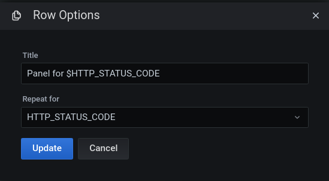

# Prometheus
Prometheus is an open source application used to monitoring applications and collecting metrics. It pull metrics form application endpoint, usally `/metrics`. This is the motive for the good performance. Applications must export in a prometheus format, for prometheus can process. Sometimes, applications can not export in this format, and we can not modify code to export, for example, databases, or operational systems. In these cases, we use an **exporter** who is responsible to collect system or application metrics, and expose prometheus format for it process.


These metrics are save in a time series database. It has an API to query metrics, an a simple interface web. We will use grafana to plot data more graceful.

### Collecting data
All data is stored as time series. Every time series is identified by the `metric name` and a set of `key-value pairs`, called `labels`. The notation of the time series is often like this:
- \<metric name>{\<label name>=\<label value>, ...}


When we are collecting data about some feature of our application, we can have problems with conection between app and prometheus, or with a reset counter of the feature. Prometheus is smart enough to try to extrapole losing data.

We have three kind of collect:
- An application expose `/metrics` in prometheus format. We need to configure prometheus to scraped these endpoints.
- An application can not expose this url, because we can not modified it, but exists some exporter (for example, node_exporter) that can collect metrics and expose to prometheus. Again, we need to configure prometheus to scrap it.
- An application has a execution cycle and is not alive all the time. Prometheus can not scraped it. We need a component `Push Gateway` that received metrics from the application.

### Concepts
- Métrics: total requisitions or duration in seconds for requisition
- Labels: Relation with metrics, is a variation, for example return code of requisition.
- Temporal serie: Every group of metrics-label tuple.
- Sample: Is an entry of these variations, composed by timestamp of the occurence and a value
- Scrapes: Every pull of metrics

### Kind of metrics
- Counter: Value always grows. These values are saved in the application, so eventualy, can be reset by restart, por example. 
- Gauge: Can change randomly, like memory usage.
- Histogram: Samples observations and it get counted into buckets. Main purpose is calculating quantiles. Ex: request time response in buckets 100ms, 200ms, 300ms, 500ms and 1s.
- Summary: is based in sample observations too, but provides a total count observations and a sum of all observed values, it calcultes configurable quantiles over a sliding time window. Ex: request time response in quantil  10%, 50%, 90%, 95% and 99%. 

### Docker
```
$ docker run --name local-prometheus -p 9090:9090 -v ~/workspace/learning-prometheus/config/prometheus.yml:/etc/prometheus/prometheus.yml -d prom/prometheus
```
*note*: If you doen't want worry with IP application, you can use `--network host` instead `-p 9090:9090`.

### Adding metrics to prometheus

Imagine that we create a counter for requisitions on application (see `app` folder). We need to add this application to prometeus adding an entry on `prometheus.yaml`:
```yaml
global:
  scrape_interval: 30s
  scrape_timeout: 10s
  evaluation_interval: 15s
scrape_configs:
  
  ... other jobs here 

- job_name: app
  static_configs:
  - targets:
    - localhost:3000
```

We can see all configured targets on `<prometheus url>/targets`:


After this, we can do some thinks. Query prometheus:
- *aula_request_total* : the name of the metric
- *increase(aula_request_total[1m])* : The occurrences of metric in a minut. 
- *sum(increase(aula_request_total[1m]))* : The occurrences of metric in a minut, summing all status. 
- *increase(aula_request_total{statusCode="200"}[1m])* : the occurrence for especific status code


### Exporter
To export SO metrics, we need to use exporters, who transform data from SO to Prometheus format.

You can follow this guide for linux: 
- https://prometheus.io/docs/guides/node-exporter/ 
- or see at github: https://github.com/prometheus/node_exporter

After this, you can put on prometheus.yml:
```yaml
 ... other configs
 - job_name: linux_so
  static_configs:
  - targets:
    - localhost:9100
```

### PromQL
We have three type of data:
- Scalar: Is a integer number
- Instant Vector: Values of temporal series in a specific time instant
- Range Vector: Values of temporal series in a range time (interval) using scrape interval to construct range.

Example of vector for `http_requests_total`:
```
http_request_total{method="POST", code="200"}
http_request_total{method="POST", code="404"}
http_request_total{method="POST", code="500"}
```

You can especify de range adding after metric:
 - `aula_request_total[1m]`  
*note*: This query returned a range vector. It is not allow to show graph! This principle is applied on Grafana too.
 
The separation between data is the scrape refresh. We can change it adding new param after time of range:
- `aula_request_total[1m:15s]`

#### Using labels
We can use labels to filter results. For example:
- `aula_request_total{statusCode="200"}` filtering results with statusCode 200
- `aula_request_total{statusCode!="200"}` filtering results with statusCode is not 200

We can use regular expressions to filter labels with sintaxe `=~`:
- `aula_request_total{method=~"GET|POST"}` filtering method *GET* or *POST*
- `aula_request_total{statusCode!~"2.."}` filtering method with statusCode is diferent than *2xx*

To filter for more than one label, we can concat the filters using `,`:
- `aula_request_total{method="POST",statusCode="200"}`

#### Counters
The counters are a number that only grows. Is not cool see this number in absolut terms. If this counter counts number of requisitions, perhaps we want to see number of requisitions for second, for example.
- `rate(aula_request_total[5m])` - average of occurences for seconds on last 5 minuts. If we want see this rate for outher unit time, we can apply multiply: `rate(aula_request_total[5m])*60`

note: *increase* do in essencial the same thing of rate, but de scale is on metric modifier. So, `increase(aula_request_total[1m])` is equals `rate(aula_request_total[1m])*60`. Rate seems more precise. 

#### Gauges
We can plot this metric very simple because is a lecture metric. The main thing that we can do is change resolution on graph, expressing in seconds:


#### Summary
Definitions of quantile. We can use the metric directly on PromQL and filtering if necessary. Is quite similar histogram

#### Histogram
We can use to calculate percetile using rate.
- `histogram_quantile(0.9, rate(aula_request_time_seconds_bucket[1m]))`
We can agregate all entries for diferent origins:
- `histogram_quantile(0.9, sum by (job, le) (rate(aula_request_time_seconds_bucket[10m])))`

The other way to work with histogram, is returning percentage of requisitions that performance specific time. We can do the next PromQL:
- `sum(increase(aula_request_time_seconds_bucket{le="0.3"}[5m]))/sum(increase(aula_request_time_seconds_count[5m]))`
*note*: we need use **sum** because we need to "clear" labels before division

#### Calculate average
Becareful using absolute values, because theses counts considere all values before start the count. So if we want calculate it, we **can not use** this:
- `aula_request_time_seconds_sum / aula_request_time_seconds_count`
We **must use** `increase` to get some significant value. For example:
- `increase(aula_request_time_seconds_sum[5m]) / increase(aula_request_time_seconds_count[5m])`

#### Agregators
We can use to apply operations for time series of a metric, for example metric `aula_request_total` has 2 series, one for label *statusCode=200* and another for *statusCode=300*. 
- sum : apply sum to all series of metric. We can use `by` to agrupate for specific label: `sum(aula_request_total) by (instance)`

We can use others like `max`, `min`, `count`, etc. More agregators on prometheus site: https://prometheus.io/docs/prometheus/latest/querying/operators/#aggregation-operators

### Service Discovery
Is a mechanism to discover services to monitoring automatically. We add a scrape config for EC2, for example, or Kubernetes too, to use to add services to prometheus.

An other way is adding manually in a config file referenced by `prometheus.yml`. This alows to add more services to monitoring without restart prometheus.

```yaml
# other configs
- job_name: external
  file_sd_configs:
    - files:
      - targets.json    
# other configs
```

```json
[
  {
    "targets": ["localhost:3002"],
    "labels": {
      "job": "app3002"
    }
  }
 // other configs
]
```
### Exporters
Exporters are use to expose metrics from softwares that are not prepare to expose prometheus metrics. Node Exporter is an example to expose SO metrics. We can, too, expose metrics from others systems. See list here: https://prometheus.io/docs/instrumenting/exporters

#### RabbitMQ

If you are running a RabbitMQ, you can expose metrics using `exporter` form https://github.com/kbudde/rabbitmq_exporter.
- Download the last binary: https://github.com/kbudde/rabbitmq_exporter/releases
- Extract in a folder
- Config a file with Rabbit informations
```json
{
    "rabbit_url": "http://127.0.0.1:15672",
    "rabbit_user": "admin",
    "rabbit_pass": "admin",
    "publish_port": "9419",
    "exlude_metrics": [],
    "include_queues": ".*",
    "skip_queues": "^$",
    "skip_vhost": "^$",
    "include_vhost": ".*",
    "rabbit_capabilities": "no_sort,bert",
    "enabled_exporters": [
            "exchange",
            "node",
            "overview",
            "queue"
    ],
    "timeout": 30,
    "max_queues": 0
}
```
- Add target on `targets.json` (example below) or on `prometheus.yaml`:
```json
[
  // other configs here
  {
    "targets": ["localhost:9419"],
    "labels": {
      "job": "rabbit"
    }
  }
]
```
- run `./rabbitmq_exporter -config-file config.json`

### Alerts
Prometheus has a complex system of alerts called AlertManager. It is quite dificult to configure and set up. I do not explain more because we focous in `grafana's alarms` later.

### Best practices
- Use labels for diferencies under the same metric, but do not overdo it
- Name metrics pattern is *application Domian_metric name_unit*. For example: `gateway_requistion_authentication_duration_second`.
- Use default units:  https://prometheus.io/docs/practices/naming/#base-units

#### Histogram or summary?
Histogram :
- Can agregate values from more than one server
- Is good when we can predict response values. For example: request time 

Summary:
- Is hard to calculate
- We can not agregate from others servers.
- Is good if the response is unpredictable
- More precision

So, if you don't have a good motive to use summary, use histogram.

## Grafana

Run in docker: 
```
docker run --name local-grafana --link local-prometheus:local-prometheus -p 3000:3000 -d grafana/grafana
```
We can use the same local network:
```
docker run --name local-grafana --network host -d grafana/grafana
```
User and password is `admin`. (we change password for `grafana`)

We need add `prometheus` as a datasource:


### Dashboard example
Based on application [app/index2.js](index2.js), we create a dashboard example


#### Active users


#### Requisitions at moment
This value is based on time selected on grafana range.


#### Requisitions / second


#### Error Requisition Tax


#### Request time percentil


#### Filtering dashboard
In dashboard settings, we can create variables.


Custom variables


Variables based on query


Panel configuration with variables

#### Repeat panels for variable
We can add a row in a dashboard, and all panels in this row can be repeat by variable


### Other grafana's options
- We can duplicate and copy panels, that can be useful in some situations
- Dashboard that we can import: https://grafana.com/grafana/dashboards?dataSource=prometheus

# References
- https://prometheus.io
- https://github.com/prometheus/prometheus
- https://github.com/in4it/prometheus-course/ 
- https://grafana.com/grafana/download
- https://hub.docker.com/r/grafana/grafana/
- https://www.udemy.com/course/monitorando-aplicacoes-com-prometheus-e-grafana

### helps
grafana: admin/grafana

#### How to up test environment
- Run docker for Prometheus and grafana:
```
docker run --name local-grafana --network host -d grafana/grafana
docker run --name local-prometheus --network host -v ~/workspace/learning-prometheus/config:/etc/prometheus -d prom/prometheus
```
- Go to `app` folder and run:
```
npm install
node ./index2.js
node ./index3.js
```
- Download `node exporter` and run:
```
./node_exporter
```
- Configure grafana datasource for prometheus
- Import `config/aulaDashboard.json` as a dashboard

